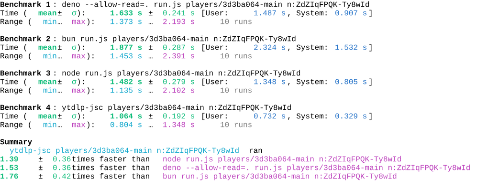

# ytdlp-jsc

YouTube player JavaScript challenge solver for yt-dlp n-parameter and signature decryption with [ytdlp-ejs](https://github.com/ahaoboy/ytdlp-ejs).

## Installation

```bash
pip install ytdlp-jsc

pip install ytdlp-jsc --target ~/.yt-dlp/plugins/
```

> **Note on plugin installation**: When installed with `--target ~/.yt-dlp/plugins/`, the package is placed into the yt-dlp plugin directory with the following structure:
>
> ```
> ~/.yt-dlp/plugins/
> └── ytdlp_jsc/
>     ├── yt_dlp_plugins/
>     │   └── extractor/
>     │       └── ytdlp_jsc_plugin.py   # plugin entry point
>     ├── ytdlp_jsc.cp3xx-*.pyd          # native Rust module
>     └── ...
> ```
>
> yt-dlp discovers the plugin by finding the `yt_dlp_plugins` namespace package inside `ytdlp_jsc/` and loading `ytdlp_jsc_plugin.py`, which registers `YtdlpJscJCP` as a JS Challenge Provider via `@register_provider`.

> **⚠️ Python version compatibility**: The native `.pyd` module is compiled for a specific Python version (e.g., `cp313` for Python 3.13). If you are using the **standalone yt-dlp executable** (`.exe`), its bundled Python may differ from your system Python. yt-dlp standalone builds use Python 3.10, so the `.pyd` must be built for Python 3.10. See [Troubleshooting](#troubleshooting) for solutions.

Build from source (requires Rust toolchain):

```bash
pip install maturin
maturin develop
```

## Verification

After installation, verify the plugin is loaded correctly with a YouTube URL:

```bash
yt-dlp --verbose "https://www.youtube.com/watch?v=BnnbP7pCIvQ" 2>&1 | grep -i "ytdlp-jsc"
```

The output should show `ytdlp-jsc` without `(unavailable)` and confirm it's solving challenges:

```
[youtube] [jsc] JS Challenge Providers: ..., ytdlp-jsc
[youtube] [jsc:ytdlp-jsc] Solving JS challenges using ytdlp-jsc
```

If it shows `(unavailable)`, the plugin was found but the native module failed to load. See [Troubleshooting](#troubleshooting).

You can also check that yt-dlp discovered the plugin directory:

```bash
yt-dlp --verbose 2>&1 | grep "Plugin directories"
# Plugin directories: .../ytdlp_jsc/yt_dlp_plugins
```

## CLI Usage

```bash
# Single request
ytdlp-jsc <player_path> <type>:<challenge>

# Multiple requests
ytdlp-jsc <player_path> <type>:<challenge> [<type>:<challenge> ...]
```

Arguments:
- `player_path`: Path to player.js file
- `type`: Request type, either `n` or `sig`
- `challenge`: String to decrypt

Examples:

```bash
# Decrypt n parameter
ytdlp-jsc players/3d3ba064-phone n:ZdZIqFPQK-Ty8wId

# Multiple challenges
ytdlp-jsc players/3d3ba064-phone n:ZdZIqFPQK-Ty8wId sig:xxxx
```

## Python API

```python
from ytdlp_jsc import solve

with open("players/3d3ba064-phone", "r") as f:
    player = f.read()

result = solve(player=player, challenge_type="n", challenge="ZdZIqFPQK-Ty8wId")
print(result)
```

## bench

```bash
hyperfine --shell fish --style=full \
    "deno --allow-read=. run.js players/3d3ba064-main n:ZdZIqFPQK-Ty8wId" \
    "bun run.js players/3d3ba064-main n:ZdZIqFPQK-Ty8wId" \
    "node run.js players/3d3ba064-main n:ZdZIqFPQK-Ty8wId" \
    "ytdlp-jsc players/3d3ba064-main n:ZdZIqFPQK-Ty8wId"
```
<div style="display: flex;">
  
</div>


## Troubleshooting

### Plugin shows `(unavailable)`

This usually means the native `.pyd` module failed to load. Common causes:

**1. Python version mismatch (most common)**

The `.pyd` file is compiled for a specific Python version (e.g., `cp313` = Python 3.13). yt-dlp standalone executables bundle Python 3.10, so a `.pyd` built for 3.13 cannot be loaded.

Solutions:
- **Use pip-installed yt-dlp** instead of the standalone exe:
  ```bash
  pip install yt-dlp
  ```
  This way yt-dlp uses your system Python (e.g., 3.13), matching the `.pyd`.

- **Build the native module for Python 3.10**:
  ```bash
  # In a Python 3.10 environment
  maturin build --release
  ```

**2. Plugin directory not found**

Ensure the directory structure matches yt-dlp's expected layout. yt-dlp looks for `<plugin_dir>/ytdlp_jsc/yt_dlp_plugins/extractor/`:

- `${APPDATA}/yt-dlp/plugins/ytdlp_jsc/yt_dlp_plugins/` (Windows, recommended)
- `~/.yt-dlp/plugins/ytdlp_jsc/yt_dlp_plugins/` (Linux/macOS)
- `<yt-dlp-exe-dir>/yt-dlp-plugins/ytdlp_jsc/yt_dlp_plugins/` (portable)

Verify with:
```bash
yt-dlp --verbose 2>&1 | grep "Plugin directories"
```

### Plugin not listed at all

If `ytdlp-jsc` doesn't appear in the `JS Challenge Providers` list:

- Check that `YTDLP_NO_PLUGINS` environment variable is not set
- Check that `--no-plugin-dirs` is not in your yt-dlp config
- Run `yt-dlp --verbose` and check for import errors

## License

MIT